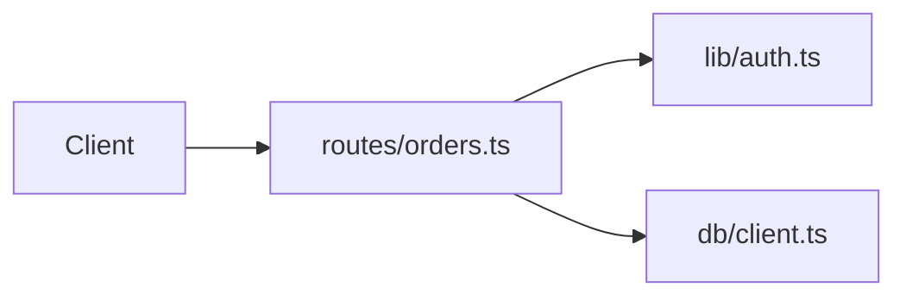

# Code map

Map of this project's codebase for the maintainer: which files do what, how data and control flow between them, where state lives. Prefer diagrams (mermaid or ASCII). Write in the first person (I, me, my).

## What belongs here

- File / module map: important paths and one-line roles
- Data and control flow between those pieces
- Where state lives (DB, files, env, memory, external services)
- Diagrams of the above when they clarify the map

## What does not belong here

- Install, run, or usage instructions — those live in root `README.md` (keep that README lean)
- Product pitch or "what this app is for" — durable product/system facts go in `scaffold/CODEMAP-LLM.md`
- Generic tutorials, glossaries, or coaching

## Example shape (replace with this project's real map)

### Layout

```
src/
  main.ts           # entry; wires the router
  routes/orders.ts  # HTTP handlers for orders
  db/client.ts      # DB connection used by routes
lib/
  auth.ts           # session checks called from routes
```

### Flow



### State

- Order rows: Postgres `orders` table (via `db/client.ts`)
- Session: cookie → checked in `lib/auth.ts`
