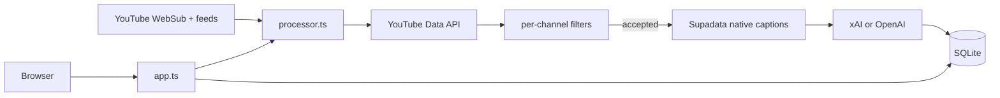

# Code map

Map of this project's codebase for the maintainer: which files do what, how data and control flow between them, where state lives. Prefer diagrams (mermaid or ASCII). Write in the first person (I, me, my).

## What belongs here

- File / module map: important paths and one-line roles
- Data and control flow between those pieces
- Where state lives (DB, files, env, memory, external services)
- Diagrams of the above when they clarify the map

## What does not belong here

- Install, run, or usage instructions — those live in root `README.md` (keep that README lean)
- Product pitch or "what this app is for" — durable product/system facts go in `scaffold/CODEMAP-LLM.md`
- Generic tutorials, glossaries, or coaching

### Layout

```
src/
  server.ts       # process entry; wires dependencies, timers, and shutdown
  app.ts          # HTTP routes, optional Basic Auth, and WebSub endpoint
  config.ts       # validates environment configuration
  database.ts     # SQLite schema and all persistence operations
  youtube.ts      # YouTube Data API, feeds, and WebSub client
  transcripts.ts  # Supadata native-caption client
  summarizers.ts  # replaceable xAI/OpenAI Responses API adapter
  processor.ts    # discovery, filtering, retries, and article pipeline
  filters.ts      # pure per-channel title and duration filtering
  views.ts        # server-rendered HTML screens
  styles.ts       # application stylesheet
  types.ts        # shared domain types
test/             # unit and HTTP integration tests
deploy/           # example systemd unit and nginx site
```

### Flow



### State

- Durable state: one SQLite file configured by `DATABASE_PATH`.
- Secrets and provider/model selection: process environment loaded from `.env` by the start command or systemd.
- In-memory state: only timers and current request/job execution; queued and retryable work remains in SQLite.
- External state: public YouTube feeds/metadata, Supadata captions, and the selected model provider.
